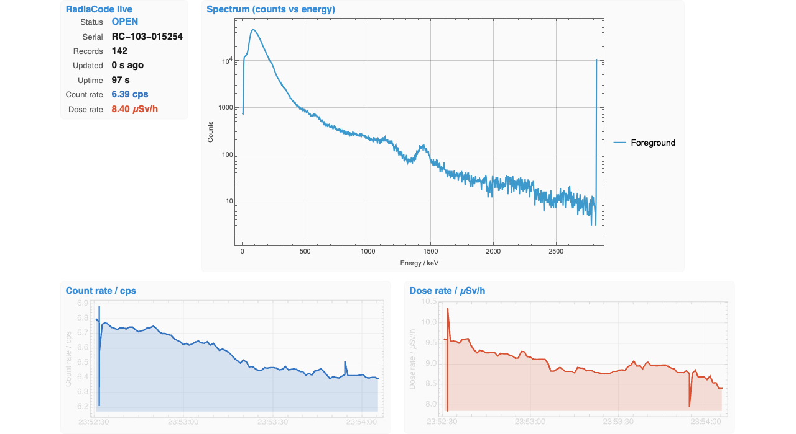
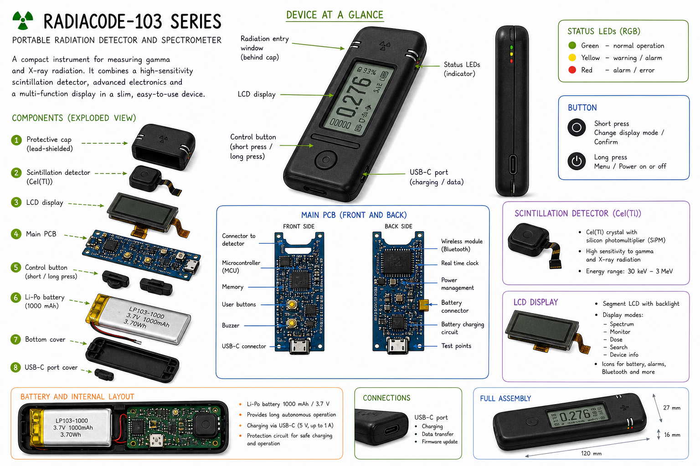
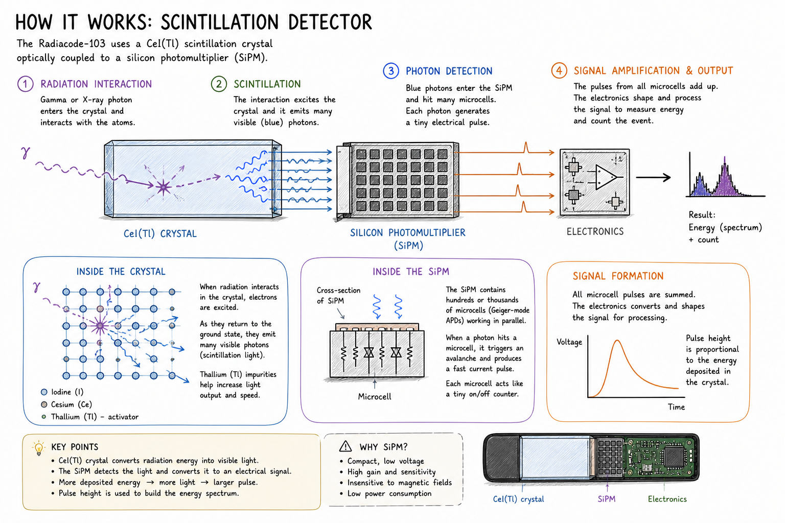
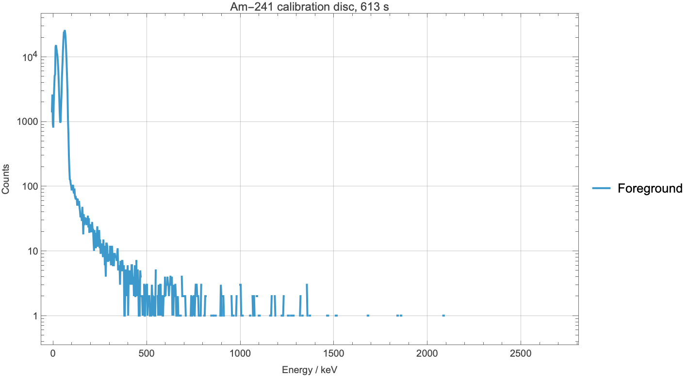
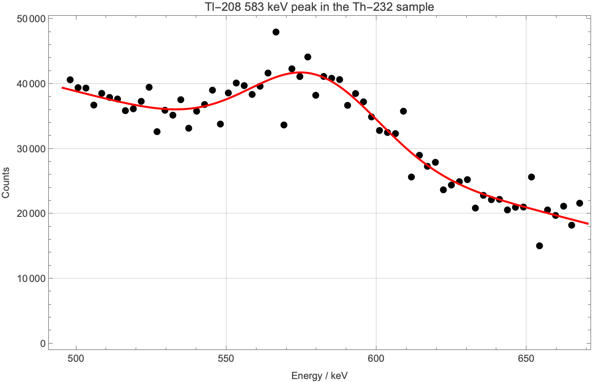
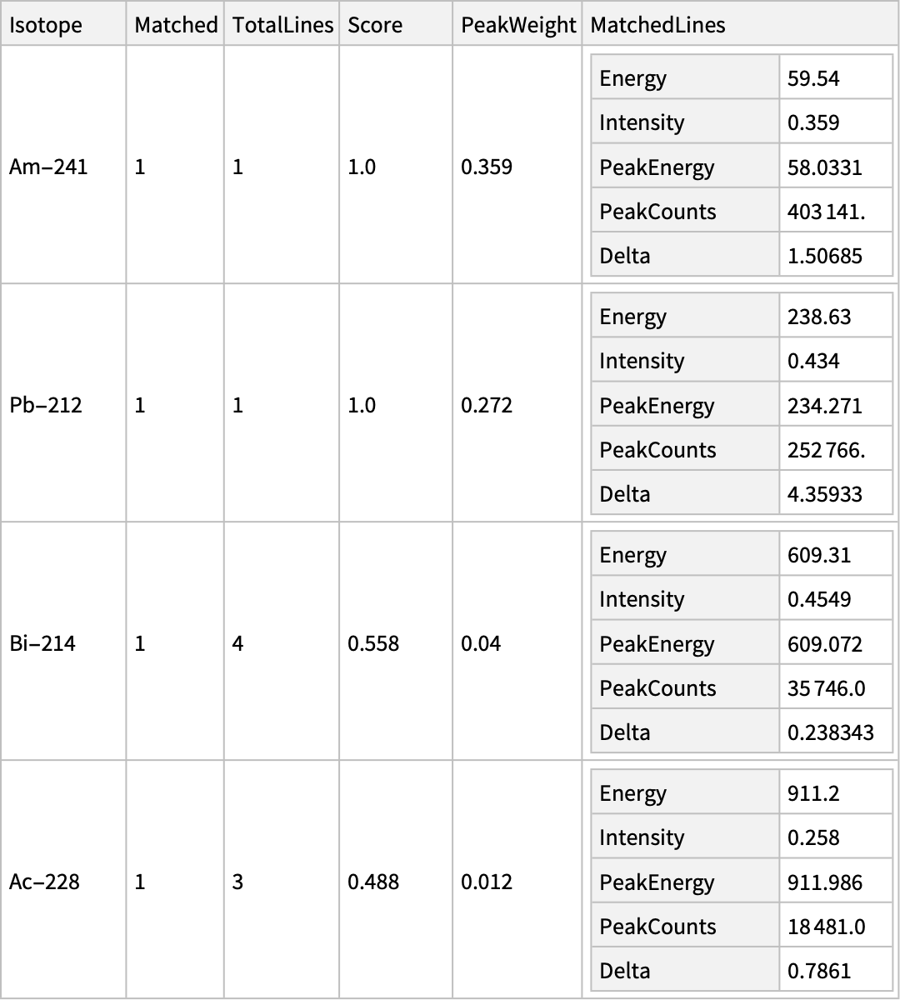

# radiacode-wolfram

A Wolfram Language toolkit for the **RadiaCode** handheld gamma‑ray
spectrometer (Scan‑Electronics RC‑10x series): parsers for the device's
native files, calibrated spectrum plots, photopeak detection, isotope
identification, energy‑resolution fits, GPS‑track survey rendering,
and a self‑updating live dashboard that talks to the device over USB —
all in idiomatic Wolfram Language.



*Live dashboard captured from a connected RadiaCode‑103 over ~97 s of
acquisition. The same expression evaluates to a `Dynamic[]` that
re‑renders in place every second; the spectrum panel rebuilds as fresh
records arrive, the count‑rate and dose‑rate panels scroll their
traces, the status block ticks the latest values.*

## Quick start

Three install paths in order of effort:

### A. Single‑file bundle — offline analysis only

Download
[`Wolfram/RadiaCodeTools/RadiaCodeToolsBundle.wl`](Wolfram/RadiaCodeTools/RadiaCodeToolsBundle.wl)
(everything in the toolkit concatenated into one ~150 KB file) and
`Get` it from anywhere — no clone, no Python, no compilation. Works
offline with the sample data files in `tests/data/`.

```wolfram
Get["~/Downloads/RadiaCodeToolsBundle.wl"]

spec = RadiaCodeTools`Formats`ImportRCSpectrum["data_am241.xml"];
RadiaCodeTools`SpectrumPlot`RCSpectrumPlot[spec]
RadiaCodeTools`Spectroscopy`IdentifyIsotopes[spec]
```

### B. Python bridge — live device, easiest live install

If you have a RadiaCode plugged in via USB and want live acquisition,
pair the bundle with the upstream Python tools that drive the device:

```sh
git clone https://github.com/ckuethe/radiacode-tools
pip install radiacode
```

Then from a Wolfram session (after `Get`‑ing the bundle):

```wolfram
spec = RadiaCodeTools`Device`RadiaCodeAcquire[
  "AccumulationTime" -> Quantity[60, "Seconds"]];
RadiaCodeTools`SpectrumPlot`RCSpectrumPlot[spec]
```

### C. Pure‑Wolfram libusb shim — live device, no Python at runtime

A LibraryLink + libusb C shim ships in [`Wolfram/RadiaCodeTools/clib/`](Wolfram/RadiaCodeTools/clib/).
One‑time build:

```sh
brew install libusb
wolframscript -file Wolfram/RadiaCodeTools/clib/build.wls
```

After the build, `radiacode_link.dylib` (or `.so` on Linux) sits next
to the C source and loads transparently:

```wolfram
RadiaCodeTools`DeviceNative`RadiaCodeNativeDevices[]
```

The RadiaCode is a **vendor‑class USB device with bulk endpoints**
(0x01 / 0x81), not a HID device — `hid_enumerate` returns nothing,
which is why the shim uses libusb (same library the upstream Python
tool uses internally).

## About the detector

Two infographics generated with **OpenAI's GPT image‑generation model**
from a verbal prompt and reference photos. Treat them as illustrative
summaries rather than authoritative engineering drawings — see
[radiacode.com/100‑series](https://www.radiacode.com/100-series) and
[radiacode.com/knowledge](https://www.radiacode.com/knowledge) for the
canonical manufacturer documentation.

### Components and physical layout



### How the scintillation detector works



## Sample outputs

A few snapshots from the worked examples in
[`Wolfram/community/RadiaCodeSpectroscopy.nb`](Wolfram/community/RadiaCodeSpectroscopy.nb).
They evaluate against the sample files in `tests/data/` so anyone can
reproduce them without owning a detector.

| Calibrated spectrum | Photopeak fit | Isotope identification |
|---|---|---|
|  |  |  |

`RCSpectrumPlot[spec]` renders a calibrated, log‑scale spectrum.
`PlotPeakFit[spec, energy]` fits a Gaussian + linear background and
reports FWHM/E in % (~8.7 % at 583 keV, canonical CsI(Tl)).
`IdentifyIsotopes[spec]` matches photopeaks against a built‑in library
of common gamma lines (Am‑241, Cs‑137, Co‑60, K‑40, Na‑22, Ba‑133,
Eu‑152, Mn‑54, Co‑57, plus dominant Bi‑214 / Pb‑214 / Tl‑208 / Ac‑228 /
Pb‑212 lines from the natural decay chains).

## What's in the box

```
Wolfram/
  RadiaCodeTools/                — toolkit packages (17 .wl files)
    Formats.wl                   — RC XML / N42 / .rctrk / .rcspg / ndjson I/O
    Calibrate.wl                 — channel→energy polynomial fit
    SpectrumPlot.wl              — RCSpectrumPlot, PeakChannels
    Spectroscopy.wl              — FindPhotopeaks, IdentifyIsotopes,
                                   FitGaussianPeak, EnergyResolution, PlotPeakFit
    N42Convert.wl                — RC XML → ANSI N42
    N42Validate.wl               — N42 well‑formedness check
    TrackPlot.wl                 — RCTrackPlot, RCTrackHistogram
    TrackEdit.wl                 — geo / time include + exclude filters
    TrackSanitize.wl             — coord / time / serial scrubbing
    SpectroPlot.wl               — spectrogram heatmaps
    SpectrogramEnergy.wl         — total dose + peak rate from spectrograms
    Deadtime.wl                  — Knoll two‑source equation
    RecursiveDeadtime.wl         — directory triplet walker
    RCSpgFromJson.wl             — ndjson → .rcspg
    RCTrkFromJson.wl             — ndjson → .rctrk
    LiveViewer.wl                — Dynamic[] dashboard + ndjson stream tail
    Device.wl                    — Python bridge (rcmultispg / radiacode_poll)
    DeviceNative.wl              — pure‑Wolfram libusb LibraryLink wrapper
    clib/radiacode_link.c        — libusb‑1.0 C shim (compile via build.wls)
    RadiaCodeToolsBundle.wl      — the whole toolkit, single file
  Tests/                         — 17 .wlt files, 172 VerificationTests
  Notebooks/
    LiveDashboard.nb             — open + plug in + Shift+Enter
  community/
    RadiaCodeSpectroscopy.nb     — Wolfram Community walk‑through
    RadiaCodeToolsBundle.wl      — drop‑in copy for the Community post
    data/                        — sample data shipped with the post
    images/                      — dashboard_live.{mp4,gif,_hero.png}
    RadiacodeInfo/               — GPT infographics + EXIF‑stripped device photo
  build_bundle.wls               — concatenates the toolkit into the bundle
tests/
  data/                          — Am‑241, Th‑232, K‑40, trinitite, walk, etc.
  data_deadtime/                 — Co‑60+Cs‑137 and Ba‑133+Eu‑152 triplets
LICENSE                          — MIT
```

## Tests

172 `VerificationTest`s across 17 `.wlt` files covering parsers,
calibration, isotope ID, peak fitting, deadtime, format conversion,
and the live‑viewer plumbing. Run all of them:

```sh
for t in Wolfram/Tests/*.wlt; do wolframscript -file "$t"; done
```

Each suite prints a pass/fail summary and exits non‑zero on failure.

## Acknowledgements

The Python tool family this Wolfram port draws on, and the sample data
under `tests/data/`, come from
[**Chris Kuethe's `radiacode-tools`**](https://github.com/ckuethe/radiacode-tools)
(MIT, Copyright (c) 2023 Chris Kuethe). The two GPT‑generated
infographics are produced via OpenAI's image generation; both are
explicitly disclosed as such in the post and in the figure captions
above. The dashboard recording, device photo, and Wolfram code in this
repository are original.

## License

[MIT](LICENSE).
